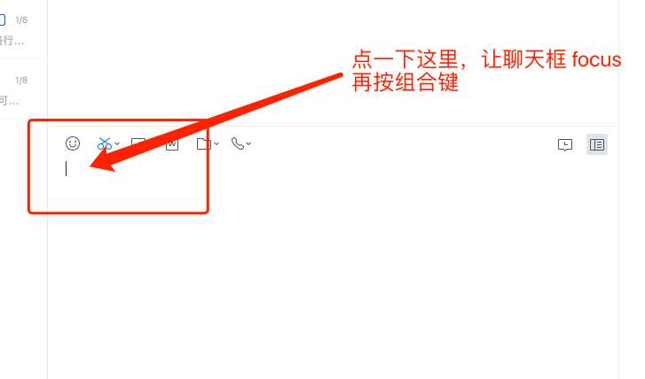

# 企业微信无法进入调试模式

官方打开调试模式文档在这里：[常见问题FAQ-客户端调试](https://work.weixin.qq.com/api/doc/90001/90148/90457#jssdk) 。

但是蛋疼的是在 Windows 下会发现把组合键 `ctrl + alt + shift + D` 按烂了都触发不了调试模式。

试了很久才发现，**需要在聊天框点一下，让聊天框 focus 了，再按组合键** 才会触发调试模式。

