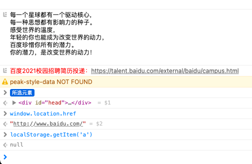

# localStorage 缓存不了

这个现象主要出现在 Mac OS 上出现，缓存不了的原因是每次刷新侧边栏页面的时候，localStorage 都会被 reset。
官方已经在[《mac 3.0.27版本企业微信 刷新或者新开页面 localStorage会被清除？》](https://developers.weixin.qq.com/community/develop/doc/0008c624d20368964bcaedff851c00?highLine=localStorage)
这个帖子里摊牌了："苹果webview控件本身会丢失localstorage，企业微信不感知，主要和系统版本有关，目前已在尽力优化"。所以目前在 Mac 上无解。

帖子里有人说是和 Mac 的版本有关，本人还没有做过验证，因为现在企业微信版本已经到了 3.1，不可能让用户只用 3.0.x 的版本了。

## 问题复现

在侧边栏配置了百度的页面，打开控制台 `localStorage.setItem('a', 1)`，刷新再输入 `localStorage.getItem('a')`，
返回值为 `null`。



除此之外，我还打开过微伴的控制台，发现里面的本地存储（localStorage）也是空的，说明他们也是面临这个问题的。

## 解决方法

经过多次尝试，发现只有 Cookie 和 indexedDB 才能做本地的持久性缓存。

### Cookie

存 userId，其它东西就不要存了，本来存量就很小

### indexedDB
很多人看到 indexedDB 就头疼，主要原因是原生 API 非常多回调，用起来很"硌手"，并没有 localStorage 一个 `set`，一个 `get` 就完事那种爽感。

这里推荐 [IDB-Keyval](https://www.npmjs.com/package/idb-keyval) 。使用起来和 localStorage 差不多：

```ts
import { set, get } from 'idb-keyval';

set('hello', 'world')
  .then(() => console.log('It worked!'))
  .catch((err) => console.log('It failed!', err));

get('hello').then((val) => console.log(val));
```

最后，想了解 indexedDB 基础可看[《浏览器数据库 IndexedDB 入门教程》](https://www.ruanyifeng.com/blog/2018/07/indexeddb.html) 。

想更多了解 IDB-Keyval，可看本人对源码的推导：[《造一个 idb-keyval 轮子》](https://github.com/Haixiang6123/learn-idb-keyval) 。

## 参考

* [mac 3.0.27版本企业微信 刷新或者新开页面 localStorage会被清除？](https://developers.weixin.qq.com/community/develop/doc/0008c624d20368964bcaedff851c00?highLine=localStorage)
