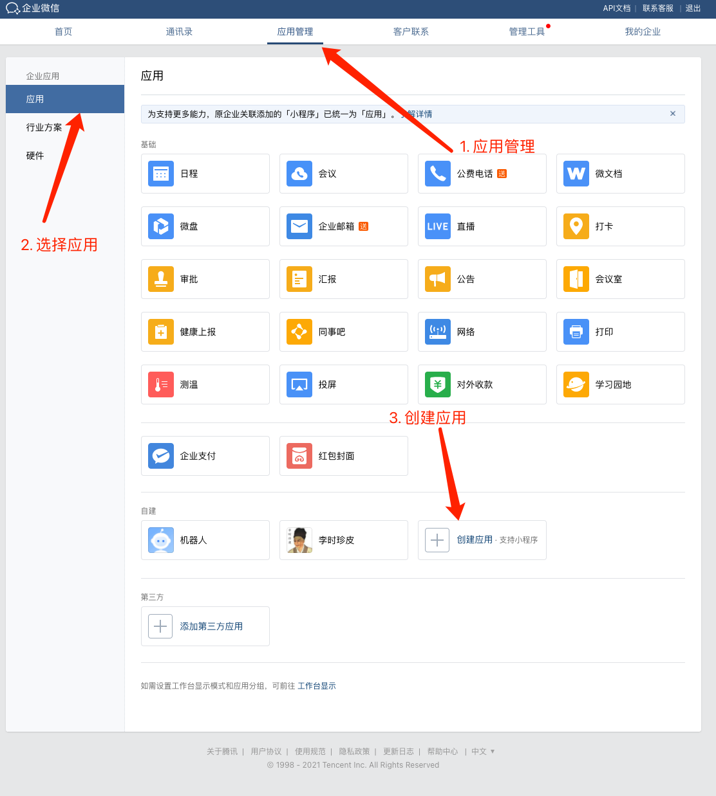
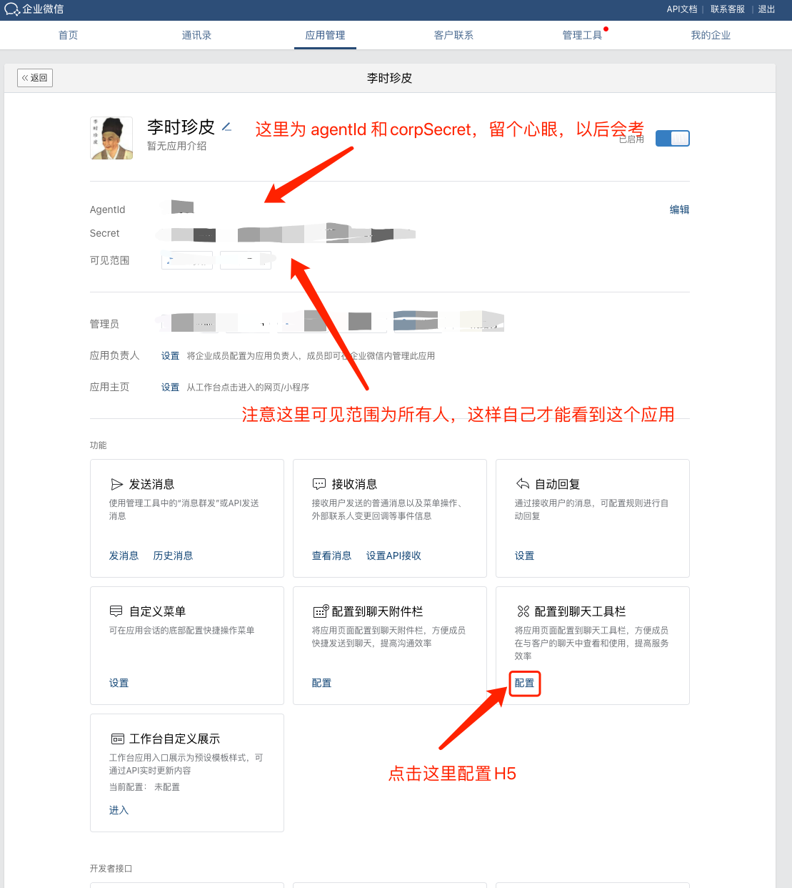
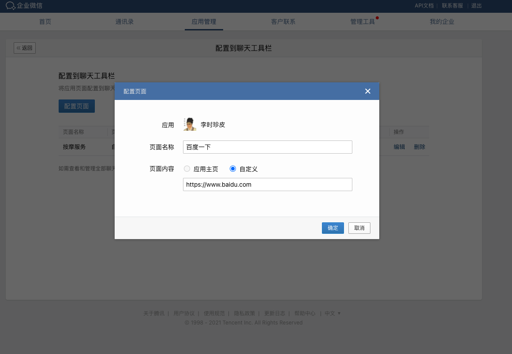

# 配置侧边栏H5

## 创建自建应用

在 [应用管理](https://work.weixin.qq.com/wework_admin/frame#apps) 的自建里，点击创建应用

然后正常填应用信息。

## 配置侧边栏

创建成功后，我们再点进去刚创建的自建应用，选择 **配置到聊天工具栏**.

然后点击 **配置页面**，我们先配置一个百度页面看看

## 添加外部联系人

刚刚配置了一个百度侧边栏，如果我们登录企业微信还是看不到侧边栏的，因为只有我们查看外部联系人的时候才会有侧边栏。

[添加外部联系人教程](https://work.weixin.qq.com/help?person_id=0&doc_id=13355)

为了测试，把自己添加为外部联系人就可以了。

## 查看效果

这里要注意：对于刚配置上去的侧边栏 H5 页面，Tab 栏不会立马更新的，你可以：

1. 重启企业微信，立马就更新
2. 等一会，再点开侧边栏

如无意外，会看到百度的页面。

## 总结

到这一步已经成功配置好一个侧边栏 H5 了。

网上还有一些开启权限的操作，后面会讲到，不要着急。
这里不想一下子全部都讲完，是希望通过**遇到问题再去解决**的方法让读者可以了解每一步的作用是什么，为什么要这么做。

OK，马上开始下一步吧~
