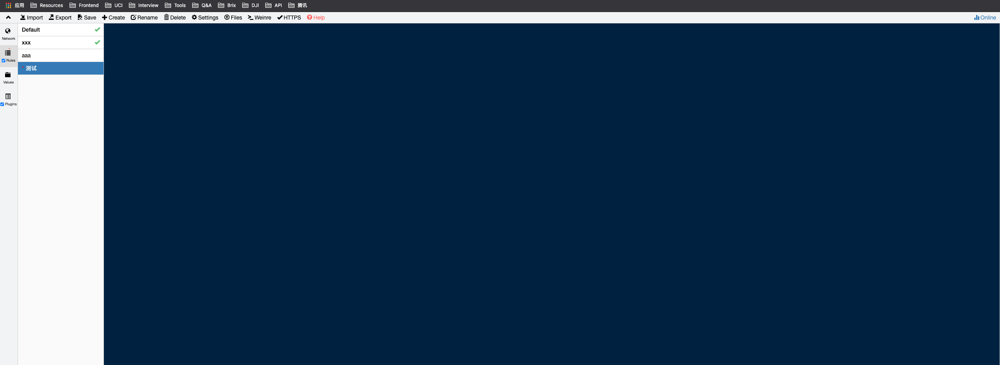
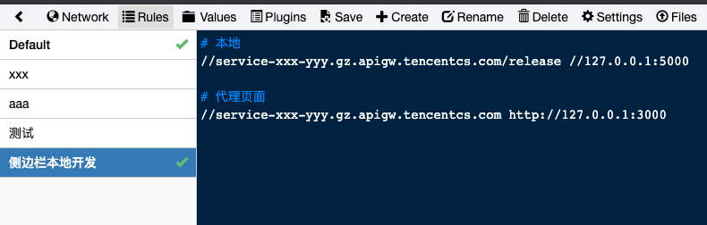
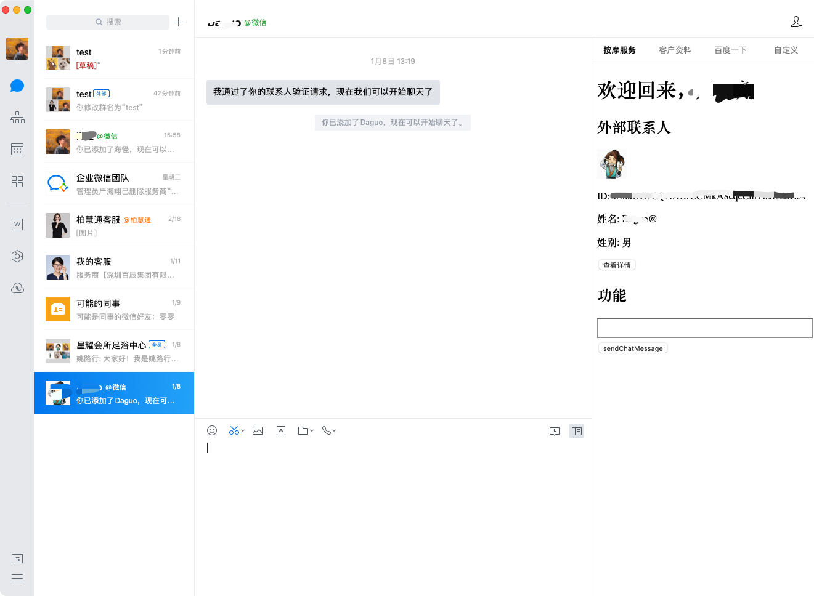

# 本地开发

刚刚已经把项目启动了，前端在 3000 端口，后端在 5000 端口。

侧边栏开发最难的莫过于配置本地开发环境了，下面就聊聊怎么搭建本地开发环境。

## 怎么把侧边栏映射到本地

翻了很多网上的资料，基本都是改 hosts 文件来让侧边栏页面 打到 localhost 的。
怎么说呢，感觉上就很不"本地"，因为会有一个"哎呀，我改了本地 hosts 文件，等开发完了要再改回去"的心理负担，不是很灵活。

我们只想做个代理、或者转发呀。

## Whistle 简介

这里就不得不安利一波我们 IMWeb 出品的 [Whistle](https://wproxy.org/whistle/) 啦，whistle(读音[ˈwɪsəl]，拼音[wēisǒu])，是基于Node实现的跨平台web调试代理工具。

有了 Whistle 代理工具，可以轻松地将侧边栏代理到 localhost：

1. 让侧边栏页面走 whistle 代理
2. 在 whistle 上设置代理规则，把页面所有请求都代理到 localhost

## 本机全局代理

首先先安装 Whistle

```shell
# 安装
npm install -g whistle

# 开启 Whistle
w2 start
```

打开 [http://127.0.0.1:8899/](http://127.0.0.1:8899/) 可见 Whistle 代理面板。



下面要把本机的请求都用 Whistle 来做代理：

**System Preferences > Network > Advanced > Proxies > HTTP or HTTPS**


这里最好 Web Proxy(HTTP) 和 Secure WebProxy(HTTPS) 都用 127.0.0.1:8899 做代理。

## 捕获 Https

配置页的一定要 https 协议的，所以我们还要允许 Whistle 捕获 HTTPS 请求。按下面步骤一步一步来，要全套做完。

[允许 Whistle 捕获 HTTPS 请求](http://wproxy.org/whistle/webui/https.html)

## 添加规则

加入规则：

```
# 代理后端（要放在最前端，不然代理规则会优先命中后面的规则）
//service-xxx-yyy.gz.apigw.tencentcs.com/release //127.0.0.1:5000

# 代理前端
//service-xxx-yyy.gz.apigw.tencentcs.com http://127.0.0.1:3000
```



重启企业微信（会有缓存），打开侧边栏。



恭喜你！已经成功搭建好了本地环境了👏
