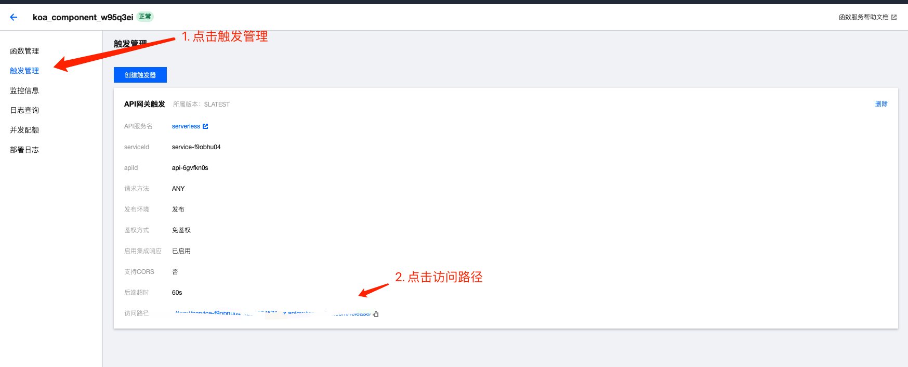
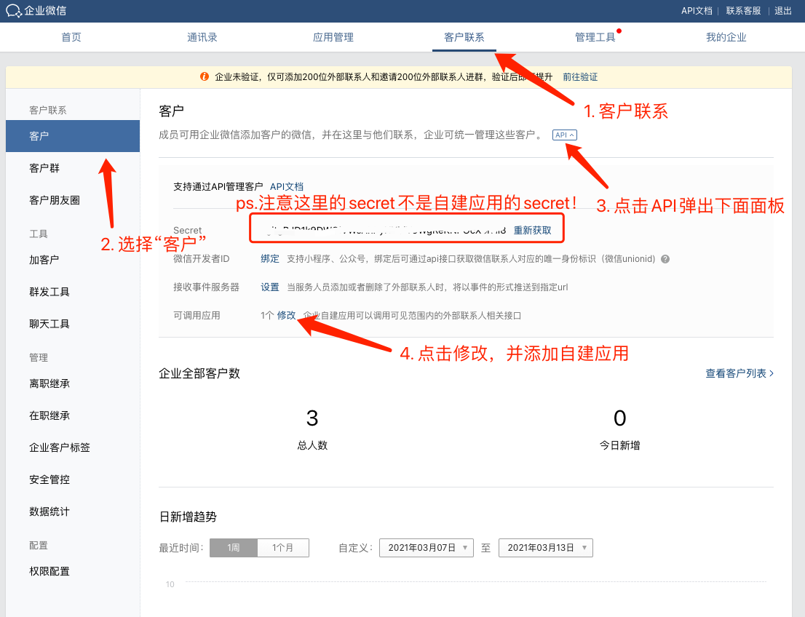

# 配置 JS-SDK

这一步非常关键。JsSdk 的配置直接影响到用户身份的获取，JsSdk 一些 API 的使用。

## 网页授权&JS-SDK授权

配置这一步可以让我们在侧边栏使用官方提供的 **JsSdk**。

在 **企业微信管理后台 - 应用管理 - 自建应用 - 选择自己的应用 - 找到"网页授权及JS-SDK"** 点击设置可信域名

按照提示下载文件，并上传到自己服务器的根目录下，然后填写可信域名，再点击确实就OK了。

**没域名、没主机的人请看下面。**

## 我啥也没有怎么办？（没有云主机和域名必看）

对于刚开始开发的你来说，上面的步骤很扯淡。

就跑个 Demo，TMD还要自己申请云主机、申请域名、再做个域名备案。等这些都准备好了，
一个月都过去了，还开发个P。

那什么东西可以又有域名，又有主机，还免费呢？云函数呀！**云函数**一般按量收费，这里仅用来验证可信域名根本没有流量好吧 **（免费）**！

可以用前端准备的云账号创建一个云函数（下面用腾讯云做示范）。

以 Koa 为模板创建一个云函数。

下一步，返回到企业微信管理后台的自建应用里，把密钥文件 `WW_verify_xxxxxx.txt` 下载，然后在云函数里创建这个文件并写入文件内容。

最后，在 `sls.js` 里把 index.html 改为我们的 `WW_verify_xxxxxx.txt`，让所有请求都返回这个文件。

点击"部署"。部署成功后，到 "触发管理" 里访问生成的路径，就会看到我们的 secret 内容了
（当然这里会有风险，可以在 API 网关里自己设置安全组。一般来说，作为 Demo 问题不大）。

云函数生成的访问路径都是像：https://service-xxxxxxxx.yy.apigw.tencentcs.com/release/ 这样的，这里的 **service-xxxxxxxx.yy.apigw.tencentcs.com** 
就是我们的可信域名了。

回到企业微信管理后台，把上面的域名填入，并勾选"用于OAuth2.0回调的可信域名是否校验"，点击确定。会显示"修改成功"。

恭喜你，最难的一步终于搞定啦，给自己鼓鼓掌 👏

## "外部联系人相关接口"授权

上面配置了 JsSdk 并不代表文档里所有的接口都能用上，像获取外部联系人 Id 的 客户端 API 还是用不了的，
强行使用会显示 "fail: no permission"。

要把"外部联系人相关接口"进行授权才能正常使用。到**客户信息 - 客户**开通当前自建应用的**外部联系人相关接口权限**。

给自己的自建应用添加使用外部联系人API的权限。

到此，你已经可以完美使用企业微信的 JsSdk 了 🙌 🎉
