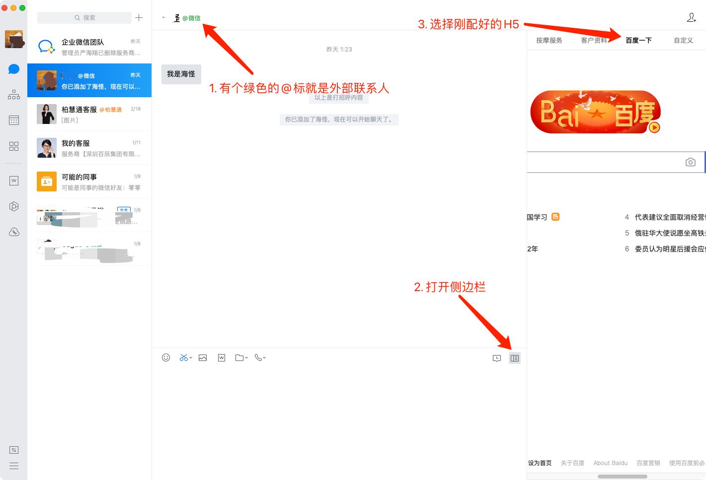

# 配置侧边栏

## 添加外部联系人

只有外部联系人才能显示侧边栏。所以，我们第一步先加个外部联系人。
为了测试，把自己添加为外部联系人就可以了。

[添加外部联系人教程](https://work.weixin.qq.com/help?person_id=0&doc_id=13355)

## 创建自建应用

管理后台 - 应用管理 - 应用 - 自建，点击创建自建应用。

填写应用信息，选择可见范围，点击创建应用。

## 添加侧边栏页面

创建成功后，点进去刚创建的自建应用，选择 **配置到聊天工具栏**.

然后点击 **配置页面**，我们先配置一个百度页面看看

## 查看效果

配置页面后，重启一下企业微信（会有缓存，不会立马更新）。
点击添加的外部联系人（比如自己的微信）,打开侧边栏，点击对应的 Tab，会看到百度页面。

到这一步已经成功配置好一个侧边栏 H5 了。
