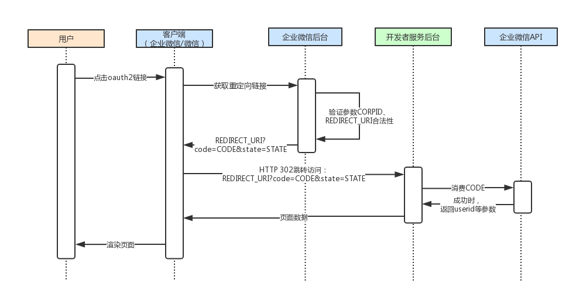

# 身份验证

用户身份即 userId 需要通过 code 换取，而 code 又是从 OAuth 重定向回来链接上的参数中获取的。

## 图解

下面是获取 userId 一个参数的整体流程，请一步一步去看完。



## 实现

下面给出我自己的实现。

### config 配置项

首先，要准备好 corpId 和 agentId 两个参数。如果忘记了在哪里可以找到这两个参数的值，请看 [《基础概念》](/guide/concept)。

```ts
const config = {
  corpId: '企业ID',
  agentId: 'AgentID'
}

export default config
```

### OAuth 链接构建

重定向链接可以帮我们获取 code 参数。

```ts
/**
 * 获取重定位的 OAuth 路径
 * @returns {string}
 */
const getOAuthUrl = (config: Config) => {
  const [redirectUri] = window.location.href.split('#');

  const searchObj = {
    appid: config.corpId,
    redirect_uri: encodeURIComponent(redirectUri),
    response_type: 'code',
    scope: 'snsapi_base',
    agentid: config.agentId,
    state: 'A1',
  };

  const search = Object.entries(searchObj)
    .map(entry => {
      const [key, value] = entry;
      return `${key}=${value}`;
    })
    .join('&');

  return `https://open.weixin.qq.com/connect/oauth2/authorize?${search}#wechat_redirect`;
};
```

`window.location.replace(getOAuthUrl)` 可以完成重定向。
参数正确的情况下网页授权成功后，链接会再重定向回当前的页面，在 query 参数上会出现 `code=xxx`。

**这个 code 有 5 分钟失效，且只要消费过就不能再用了。**

### 获取 userId

获取 userId 有两个地方可拿到：Cookie 缓存和用 code 和 access_token 请求 https://qyapi.weixin.qq.com/cgi-bin/service/getuserinfo3rd 获取。

获取 Cookie 缓存很简单，这里用 [js-cookie](https://www.npmjs.com/package/js-cookie) 这个库获取。

没有缓存的情况，access_token 是后端缓存，前端不用管，而 code 的获取就需要刚刚实现的 `getOAuthUrl` 来重定向了。

```ts
import Cookies from 'js-cookie'
import qs from 'qs'

// code + access_token 换取 userId 的请求函数
type GetUserId = (code: string) => Promise<string>

/**
 * 判断查询参数是否存在 code
 * @returns {boolean}
 */
const hasCodeExisted = () => window.location.search.includes('code');

/**
 * 判断当前网页是否需要重定向
 */
const checkRedirect = async (config: Config, getUserId: GetUserId) => {
  const userId = Cookies.get('userId')

  const unAuth = !userId || userId === 'undefined' || userId === 'null'

  // 判断是否需要重定向
  if (unAuth && !hasCodeExisted()) {
    window.location.replace(getOAuthUrl(config));
  }

  // 判断是否需要重新获取 userId
  if (unAuth) {
    const code = qs.parse(window.location.search.slice(1)).code as string

    const newUserId = await getUserId(code)

    Cookies.set('userId', newUserId)
  }
};
```

GetUserId 类型是发 AJAX 请求的回调，入参需要填入 `code` 即可。
这里有坑点是如果服务器挂了的时候，cookie 还有可能把 `undefined` 和 `null` 作为字符串存入，所以还要把这两值给判断了。

**注意，这里的 userId 是长存到侧边栏的，因为只要这个用户没有退出账号那么就一定是在线的，只有退出账号了 cookie 才会被重置。这也是官方推荐的缓存方案。**

**重定向这一步很影响用户体验，最好把 `checkRedirect(config, getUserId)` 提前执行。**

## 参考

* [身份验证-开始开发](https://work.weixin.qq.com/api/doc/90001/90143/91118)
* [身份验证-构造网页授权链接](https://work.weixin.qq.com/api/doc/90001/90143/91120)
* [身份验证-获取访问用户身份](https://work.weixin.qq.com/api/doc/90001/90143/91121)
